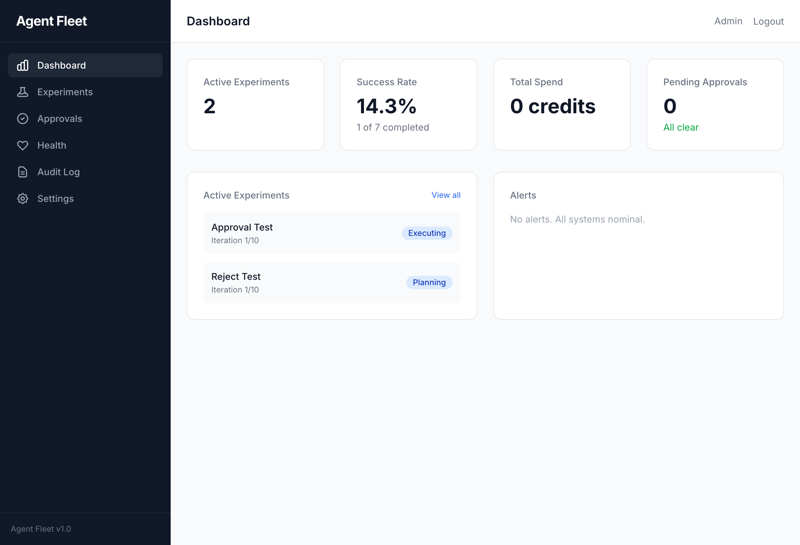
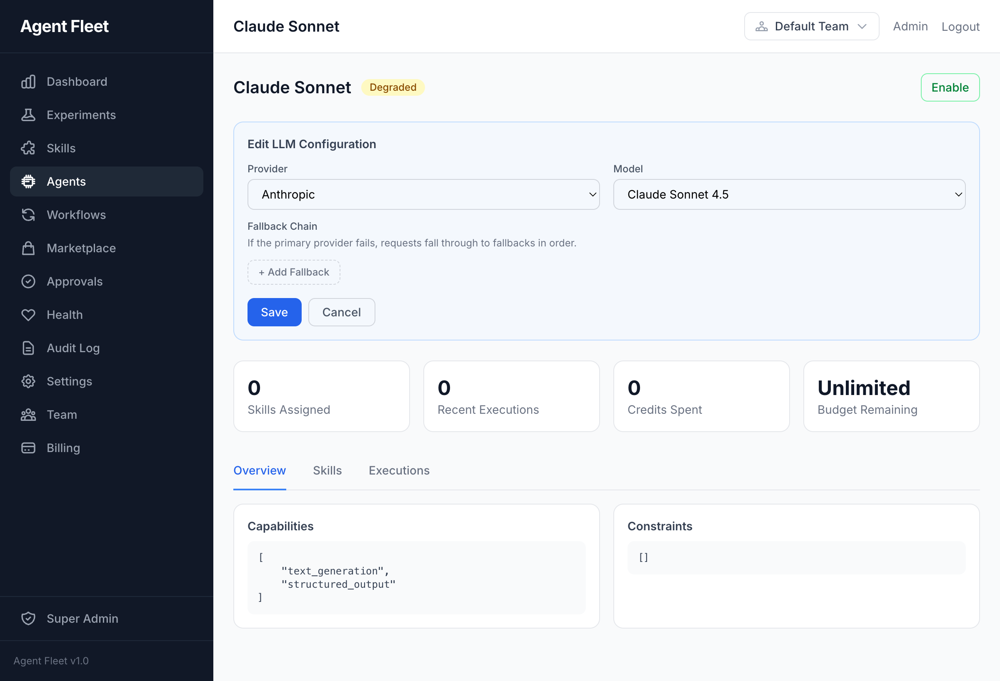
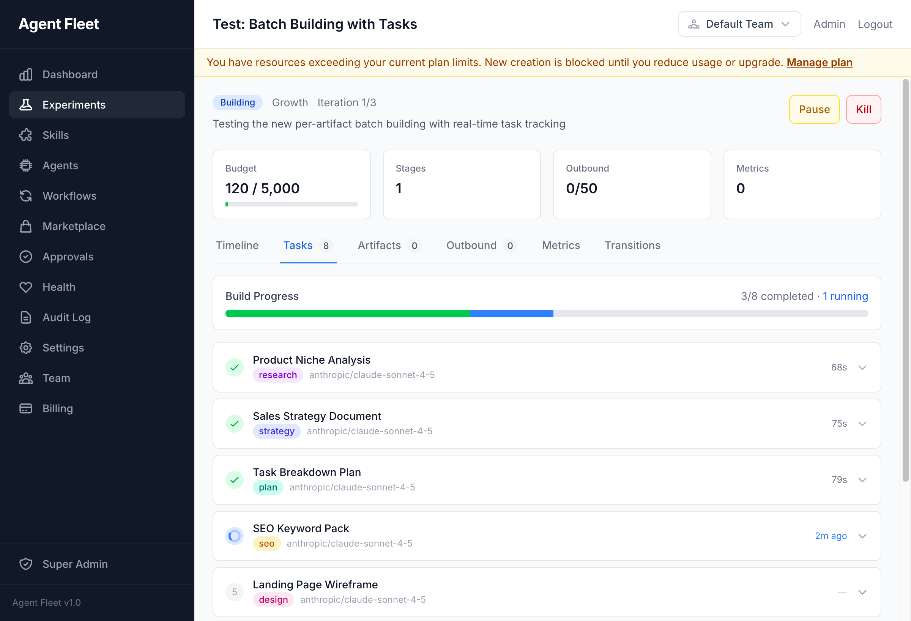
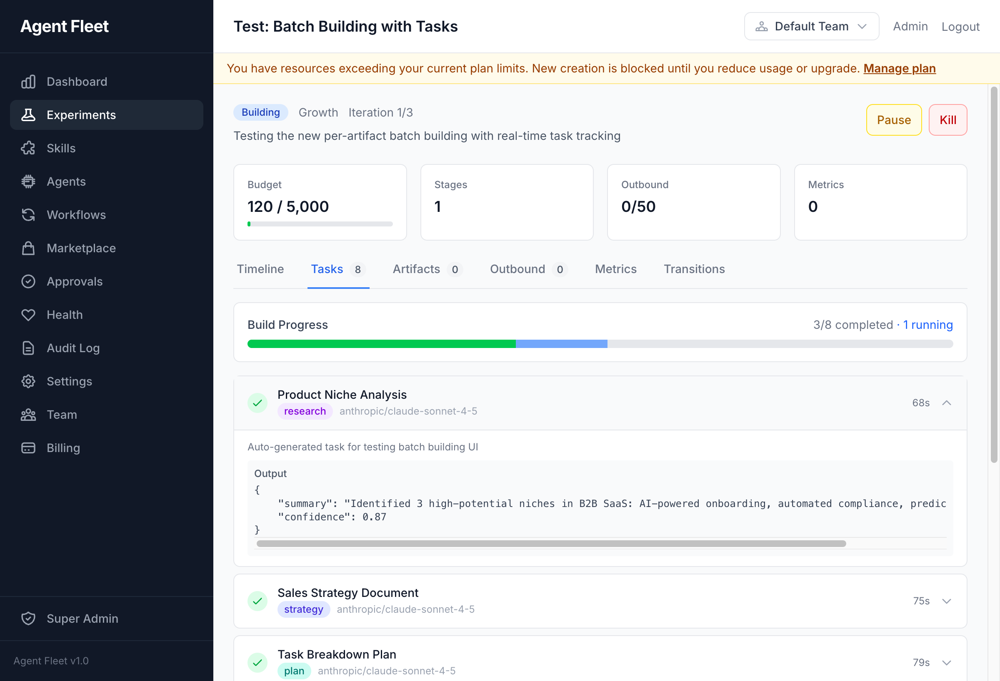
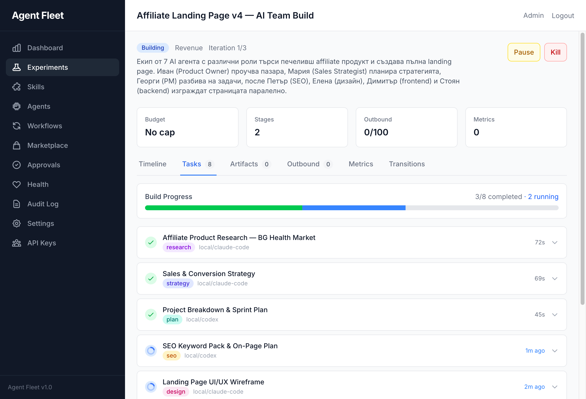
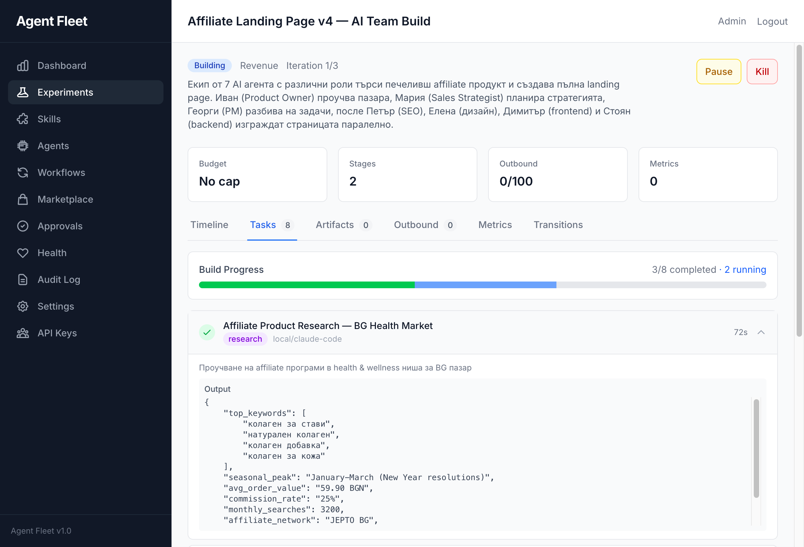
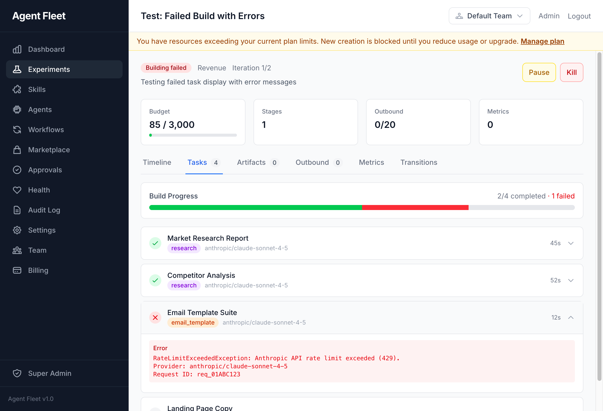
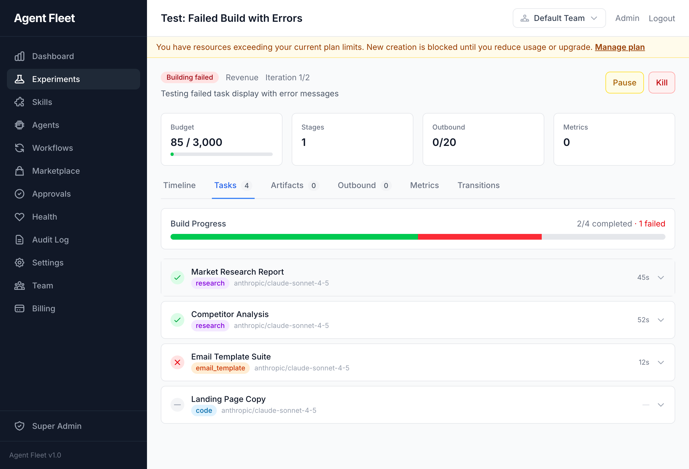

# Agent Fleet - Community Edition

Self-hosted AI Agent Mission Control platform. Build, orchestrate, and monitor AI agent experiments with a visual pipeline, human-in-the-loop approvals, and full audit trail.

[](https://github.com/escapeboy/agent-fleet-o/actions/workflows/ci.yml)
[](LICENSE)
[](https://www.php.net/)
[](https://laravel.com/)

## Screenshots

### Dashboard
KPI overview with active experiments, success rate, budget spend, and pending approvals.



### Agent LLM Configuration
Per-agent provider and model selection with fallback chains. Supports Anthropic, OpenAI, Google, and local agents (Codex, Claude Code).



### Crew Execution - Real-Time Task Tracking
Live progress tracking during multi-agent crew execution. Each task shows its assigned skill, provider, and elapsed time.



### Task Output - Expanded Results
Expand any completed task to inspect the AI-generated output, including structured JSON responses.



### Multi-Agent Crew - Parallel Execution
A 7-agent crew executing in parallel: research, strategy, planning, SEO, design, frontend, and backend tasks running simultaneously with local agent backends.



### Internationalization Support
Full i18n support with Cyrillic and other non-Latin character sets in AI outputs.



### Error Handling
Failed tasks display detailed error information including provider, error type, and request IDs for debugging.



### Build Failure States
Build progress bar shows completed vs failed tasks at a glance with clear error indicators.



## Features

- **Experiment Pipeline** -- 20-state machine with automatic stage progression (scoring, planning, building, approval, execution, metrics collection)
- **AI Agents** -- Configure agents with roles, goals, backstories, and skill assignments
- **Agent Crews** -- Multi-agent teams with lead/member roles and shared context
- **Skills** -- Reusable AI skill definitions (LLM, connector, rule, hybrid) with versioning and cost tracking
- **Playbooks** -- Sequential or parallel multi-step workflows combining skills
- **Workflows** -- Visual DAG builder for multi-agent pipelines with conditional branching
- **Projects** -- One-shot and continuous long-running agent projects with cron scheduling, budget caps, milestones, and overlap policies
- **Human-in-the-Loop** -- Approval queue with configurable timeouts for high-risk actions
- **Multi-Channel Outbound** -- Email (SMTP), Telegram, Slack, and webhook delivery with rate limiting
- **Signal Ingestion** -- Webhooks (HMAC-SHA256) and RSS polling for inbound data
- **Budget Controls** -- Per-experiment and per-project credit ledger with pessimistic locking and auto-pause on overspend
- **Marketplace** -- Browse, publish, and install shared skills, agents, and workflows
- **REST API** -- 68 endpoints under `/api/v1/` with Sanctum auth, cursor pagination, and auto-generated OpenAPI 3.1 docs at `/docs/api`
- **Local Agents** -- Run Codex and Claude Code as local execution backends (auto-detected, zero cost)
- **Audit Trail** -- Full activity logging with searchable, filterable audit log
- **AI Gateway** -- Provider-agnostic LLM access via PrismPHP with circuit breakers and fallback chains
- **BYOK** -- Bring your own API keys for Anthropic, OpenAI, or Google
- **Queue Management** -- Laravel Horizon with 6 priority queues and auto-scaling

## Quick Start (Docker)

```bash
git clone https://github.com/escapeboy/agent-fleet-o.git
cd agent-fleet
make install
```

This will:
1. Copy `.env.example` to `.env`
2. Build and start all Docker services
3. Run the interactive setup wizard (database, admin account, LLM provider)

Visit **http://localhost:8080** when complete.

## Quick Start (Manual)

Requirements: PHP 8.4+, PostgreSQL 17+, Redis 7+, Node.js 20+, Composer

```bash
git clone https://github.com/escapeboy/agent-fleet-o.git
cd agent-fleet
composer install
npm install && npm run build
cp .env.example .env
# Edit .env with your database and Redis credentials
php artisan app:install
php artisan horizon &
php artisan serve
```

## Configuration

All configuration is in `.env`. Key variables:

```bash
# Database (PostgreSQL required)
DB_CONNECTION=pgsql
DB_HOST=postgres
DB_DATABASE=agent_fleet

# Redis (queues, cache, sessions, locks)
REDIS_HOST=redis
REDIS_DB=0          # Queues
REDIS_CACHE_DB=1    # Cache
REDIS_LOCK_DB=2     # Locks

# LLM Providers -- at least one required
ANTHROPIC_API_KEY=
OPENAI_API_KEY=
GOOGLE_AI_API_KEY=
```

Additional LLM keys can be configured in **Settings > AI Provider Keys** after login.

## Architecture

Built with Laravel 12, Livewire 4, and Tailwind CSS. Domain-driven design with 12 bounded contexts:

| Domain | Purpose |
|--------|---------|
| Agent | AI agent configs, crews, execution history |
| Experiment | Pipeline, state machine, playbooks |
| Signal | Inbound data ingestion |
| Outbound | Multi-channel delivery |
| Approval | Human-in-the-loop reviews |
| Budget | Credit ledger, cost enforcement |
| Metrics | Measurement, revenue attribution |
| Audit | Activity logging |
| Skill | Reusable AI skill definitions |
| Workflow | Visual DAG builder, graph executor |
| Project | Continuous/one-shot projects, scheduling |
| Marketplace | Skill/agent/workflow sharing |

## Docker Services

| Service | Purpose | Port |
|---------|---------|------|
| app | PHP 8.4-fpm | -- |
| nginx | Web server | 8080 |
| postgres | PostgreSQL 17 | 5432 |
| redis | Cache/Queue/Sessions | 6379 |
| horizon | Queue workers | -- |
| scheduler | Cron jobs | -- |
| vite | Frontend dev server | 5173 |

## Common Commands

```bash
make start          # Start services
make stop           # Stop services
make logs           # Tail logs
make update         # Pull latest + migrate
make test           # Run tests
make shell          # Open app container shell
```

Or with Docker Compose directly:

```bash
docker compose exec app php artisan tinker       # REPL
docker compose exec app php artisan test          # Run tests
docker compose exec app php artisan migrate       # Run migrations
```

## Upgrading

```bash
make update
```

This pulls the latest code, rebuilds containers, runs migrations, and clears caches.

## Tech Stack

- **Framework:** Laravel 12 (PHP 8.4)
- **Database:** PostgreSQL 17
- **Cache/Queue:** Redis 7
- **Frontend:** Livewire 4 + Tailwind CSS 4 + Alpine.js
- **AI Gateway:** PrismPHP
- **Queue:** Laravel Horizon
- **Auth:** Laravel Fortify (2FA) + Sanctum (API tokens)
- **Audit:** spatie/laravel-activitylog
- **API Docs:** dedoc/scramble (OpenAPI 3.1)

## Contributing

Contributions are welcome. Please open an issue first to discuss proposed changes.

1. Fork the repository
2. Create a feature branch (`git checkout -b feat/my-feature`)
3. Make your changes and add tests
4. Run `php artisan test` to verify
5. Submit a pull request

## License

Agent Fleet Community Edition is open-source software licensed under the [GNU Affero General Public License v3.0](LICENSE).
