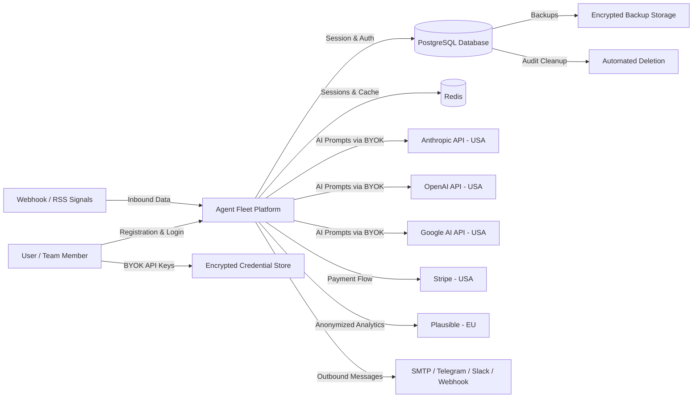

# Data Protection Impact Assessment (DPIA)

**Project/Feature:** Agent Fleet — AI Agent Mission Control Platform
**Date:** 22 February 2026
**Assessor:** Compliance Audit (Claude Code)
**Version:** 1.0
**Status:** Draft

## 1. Overview

### 1.1 Description of Processing
Agent Fleet is a SaaS platform that enables users to create, configure, and execute AI agents powered by large language models (LLMs). The platform processes user data through AI models (Anthropic Claude, OpenAI GPT-4o, Google Gemini) for experiment pipelines, workflow automation, and skill execution. Users provide their own API keys (BYOK model) to connect with AI providers.

### 1.2 Why is a DPIA Required?
A DPIA is mandatory under GDPR Article 35 when processing is likely to result in high risk to individuals. This DPIA was triggered by:

- [x] Innovative use of new technologies (AI/LLM processing)
- [x] Large-scale processing of personal data (multi-tenant SaaS)
- [x] Automated decision-making with potential significant effects
- [x] Data matching or combining datasets (multi-source signal ingestion)
- [ ] Systematic monitoring of public areas
- [ ] Processing of sensitive/special category data
- [ ] Large-scale profiling
- [ ] Processing of vulnerable individuals' data
- [ ] Processing that prevents data subjects from exercising rights

## 2. Data Processing Details

### 2.1 Personal Data Inventory

| Data Element | Category | Sensitivity | Source | Retention |
|-------------|----------|-------------|--------|-----------|
| Full name | Identity | Standard | Registration form | Duration of account + 6 months |
| Email address | Contact | Standard | Registration form | Duration of account + 6 months |
| Password (hashed) | Authentication | High | Registration form | Duration of account |
| 2FA secrets | Authentication | High (encrypted) | User setup | Duration of account |
| IP address | Technical | Standard | Automatic collection | Session duration |
| API keys (BYOK) | Credential | High (encrypted) | User configuration | Until revoked |
| AI prompts/responses | Content | Variable | Experiment execution | 90 days (configurable) |
| Billing information | Financial | High | Stripe checkout | 7 years (tax law) |
| Usage metrics | Behavioral | Standard | Automatic tracking | 12 months aggregated |
| Audit trail | Activity | Standard | System logging | 30-365 days (per plan) |

### 2.2 Data Subjects

| Category | Estimated Volume | Vulnerable? |
|----------|-----------------|-------------|
| Platform users (team members) | 100-10,000 | No |
| End users of AI workflows | Variable (depends on Controller use) | Potentially |
| Experiment/signal subjects | Variable | Potentially |

### 2.3 Processing Activities

| Activity | Purpose | Legal Basis | Automated? |
|----------|---------|-------------|------------|
| User registration | Account creation | Contract | No |
| AI agent execution | Core service delivery | Contract | Yes |
| Experiment pipeline | Automated workflow processing | Contract | Yes |
| Signal ingestion | Data processing triggers | Contract / Legitimate interest | Yes |
| Outbound delivery | Email/Slack/Telegram notifications | Contract | Yes |
| Budget tracking | Cost control and billing | Contract | Yes |
| Approval workflows | Human-in-the-loop review | Legitimate interest | Partially |
| Usage analytics (Plausible) | Service improvement | Legitimate interest | Yes (anonymized) |
| Audit logging | Security and compliance | Legal obligation | Yes |

### 2.4 Data Flows

### 2.5 Third-Party Processors

| Processor | Service | Data Shared | Location | DPA in Place? |
|-----------|---------|-------------|----------|--------------|
| Anthropic | AI model inference (Claude) | Prompts, context data | USA | Required |
| OpenAI | AI model inference (GPT-4o) | Prompts, context data | USA | Required |
| Google | AI model inference (Gemini) | Prompts, context data | USA | Required |
| Stripe | Payment processing | Billing info, email | USA | Yes |
| Plausible Analytics | Cookieless analytics | None (anonymized) | EU (Germany) | N/A |
| Hosting Provider | Infrastructure | All platform data | EU | Required |

## 3. Necessity and Proportionality Assessment

### 3.1 Is the Processing Necessary?

| Question | Answer | Justification |
|----------|--------|---------------|
| Is this the minimum data needed? | Yes | Only account data (name, email) and user-configured AI data are processed |
| Could the purpose be achieved with less data? | No | Core service requires account identity and AI prompt processing |
| Could anonymized/pseudonymized data be used? | Partially | Analytics use Plausible (anonymized). AI processing requires actual content. |
| Is the retention period proportionate? | Yes | 90-day default for AI logs, configurable per plan, automated cleanup |

### 3.2 Lawful Basis Justification

- **Contract (Art. 6(1)(b)):** Core service delivery — account management, AI agent execution, experiment pipeline, billing — requires processing personal data as part of the service agreement.
- **Legitimate Interest (Art. 6(1)(f)):** Security monitoring, rate limiting, anonymized analytics — balancing test confirms minimal privacy impact with significant service quality benefits.
- **Legal Obligation (Art. 6(1)(c)):** Audit trails and billing records — required by Bulgarian tax law and GDPR accountability principle.

### 3.3 Data Subject Rights

| Right | Implemented? | Mechanism |
|-------|-------------|-----------|
| Access (Art. 15) | Partial | API endpoint available; no self-service UI yet |
| Rectification (Art. 16) | Yes | Users can update profile and team settings |
| Erasure (Art. 17) | Partial | Account deletion available; automated audit cleanup; manual request for full erasure |
| Restriction (Art. 18) | Partial | Account can be disabled; manual process for processing restriction |
| Portability (Art. 20) | Partial | API access to experiment and agent data; no standardized export format yet |
| Object (Art. 21) | Partial | Can unsubscribe from notifications; manual process for other objections |

## 4. Risk Assessment

### 4.1 Risk Identification

| # | Risk Description | Data Subjects Affected | Impact | Likelihood | Risk Level |
|---|-----------------|----------------------|--------|------------|------------|
| R1 | Unauthorized access to AI prompts/responses containing personal data | All platform users | High | Medium | High |
| R2 | Cross-border data transfer to US-based AI providers without adequate safeguards | EU users | High | Medium | High |
| R3 | API key compromise leading to unauthorized AI provider access | Team owners/admins | High | Low | Medium |
| R4 | Excessive retention of AI execution logs | All users | Medium | Medium | Medium |
| R5 | Lack of data subject rights automation (manual process) | All users | Medium | Medium | Medium |
| R6 | AI model generating or exposing personal data in outputs | Variable | Medium | Medium | Medium |
| R7 | Insufficient audit trail for data access | All users | Medium | Low | Low |
| R8 | Session hijacking via inadequate cookie security | All users | High | Low | Medium |

### 4.2 Impact Scale

| Level | Description |
|-------|-------------|
| **Low** | Minor inconvenience, easily recoverable |
| **Medium** | Significant inconvenience, financial loss, or reputational damage |
| **High** | Serious physical, material, or non-material damage |
| **Very High** | Irreversible impact, threat to life, liberty, or physical integrity |

### 4.3 Likelihood Scale

| Level | Description |
|-------|-------------|
| **Remote** | Unlikely to occur |
| **Low** | Could occur but improbable |
| **Medium** | Reasonable possibility |
| **High** | Expected to occur |

## 5. Risk Mitigation Measures

| Risk # | Mitigation Measure | Type | Status | Responsible | Deadline |
|--------|-------------------|------|--------|-------------|----------|
| R1 | Role-based access control (owner/admin/member/viewer) | Technical | Done | Dev Team | -- |
| R1 | Encrypted storage of sensitive fields (API keys, 2FA) | Technical | Done | Dev Team | -- |
| R1 | Security headers middleware (HSTS, X-Frame-Options, etc.) | Technical | Done | Dev Team | -- |
| R2 | Standard Contractual Clauses with all US processors | Organizational | Planned | DPO | Q2 2026 |
| R2 | Transfer Impact Assessment for each AI provider | Organizational | Planned | DPO | Q2 2026 |
| R3 | Encrypted credential storage with Laravel `encrypted` cast | Technical | Done | Dev Team | -- |
| R3 | API key rotation capabilities | Technical | Done | Dev Team | -- |
| R4 | Configurable audit retention per plan (30-365 days) | Technical | Done | Dev Team | -- |
| R4 | Automated `audit:cleanup` command (daily) | Technical | Done | Dev Team | -- |
| R5 | Implement self-service data export/deletion UI | Technical | Planned | Dev Team | Q3 2026 |
| R5 | Automated DSR handling workflow | Organizational | Planned | DPO | Q3 2026 |
| R6 | Human-in-the-loop approval workflows for high-risk operations | Technical | Done | Dev Team | -- |
| R6 | Budget and rate limiting to control AI usage | Technical | Done | Dev Team | -- |
| R7 | Comprehensive audit logging (spatie/laravel-activitylog) | Technical | Done | Dev Team | -- |
| R8 | Secure session configuration (HttpOnly, Secure, SameSite) | Technical | Planned | Dev Team | Q2 2026 |
| R8 | CSRF protection on all forms | Technical | Done | Dev Team | -- |

## 6. Residual Risk Assessment

After mitigation measures:

| Risk # | Original Level | Residual Level | Acceptable? |
|--------|---------------|----------------|-------------|
| R1 | High | Low | Yes |
| R2 | High | Medium | Yes (with SCCs) |
| R3 | Medium | Low | Yes |
| R4 | Medium | Low | Yes |
| R5 | Medium | Medium | Yes (with planned improvements) |
| R6 | Medium | Low | Yes |
| R7 | Low | Low | Yes |
| R8 | Medium | Low | Yes (with planned improvements) |

## 7. DPO Consultation

### 7.1 DPO Opinion
The DPO (Nikola Katsarov, nikola.katsarov@pricex.app) should review this DPIA and provide formal opinion on:
- Adequacy of current mitigation measures
- Priority of planned improvements (especially DSR automation and SCCs)
- Whether prior consultation with the supervisory authority is needed

### 7.2 Supervisory Authority Consultation (Art. 36)
Is prior consultation with the supervisory authority required?
- [x] No — residual risks are acceptable after mitigation measures are fully implemented
- [ ] Yes — prior consultation required because: _(not applicable)_

**Note:** If the BYOK model is expanded to allow processing of special category data (health, biometric, etc.), this assessment must be revisited and prior consultation may become necessary.

## 8. Decision

| Aspect | Decision |
|--------|----------|
| **Overall Risk Level** | Medium |
| **Processing Approved?** | Yes with conditions |
| **Conditions** | 1. Execute SCCs with all US-based processors by Q2 2026. 2. Implement self-service DSR handling by Q3 2026. 3. Configure secure session cookies (HttpOnly, Secure, SameSite). 4. Review this DPIA annually or upon significant platform changes. |
| **Review Date** | 22 February 2027 |

## 9. Approval

| Role | Name | Date | Signature |
|------|------|------|-----------|
| Project Owner | ___________________ | __________ | ___________ |
| Data Protection Officer | Nikola Katsarov | __________ | ___________ |

## 10. Review History

| Version | Date | Changes | Author |
|---------|------|---------|--------|
| 1.0 | 22 February 2026 | Initial DPIA | Compliance Audit (Claude Code) |

---

*This DPIA was generated as part of a compliance audit. It should be reviewed by a qualified legal professional and the designated DPO before formal approval.*
